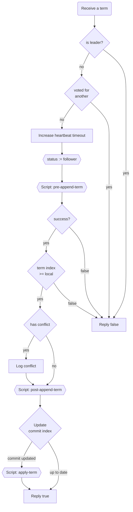

# On append term receive

```mermaid
flowchart TD
    start(Receive a term)
    success_1{success?}
    is_uptodate{term index\n>= local}
    is_leader{is leader?}
    conflict{has conflict}
    log_conflict[Log conflict]
    update_commit{Update\ncommit index}
    follower{{status := follower}}
    update_heartbeat_timeout[Increase heartbeat timeout]
    false[Reply false]
    true[Reply true]
    vote{voted for\nanother}

    start --> is_leader
    is_leader --> |no| vote --> |no| update_heartbeat_timeout
    vote --> |yes| false
    update_heartbeat_timeout --> follower
    follower --> pre_append
    pre_append -->  success_1
    success_1 --> |yes| is_uptodate
    success_1 --> |false| false
    is_leader --> |yes| false
    is_uptodate --> |yes| conflict
    conflict --> |yes| log_conflict
    conflict --> |no| post_append
    log_conflict --> post_append
    is_uptodate --> |false| false
    post_append --> update_commit
    update_commit --> |commit updated| apply
    apply --> true
    update_commit --> |up to date| true

    pre_append{{Script: pre-append-term}}
    post_append{{Script: post-append-term}}
    apply{{Script: apply-term}}
```
