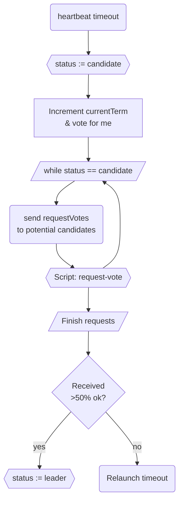

# Candidate workflow

Also called the heartbeat timeout, when this timeout reach, we start a candidature workflow described as followed.

```mermaid
flowchart TD
    start(heartbeat timeout)
    candidate{{status := candidate}}
    while[/while status == candidate/]
    timeout(Relaunch timeout)
    increment[Increment currentTerm\n& vote for me]
    send(send requestVotes\nto potential candidates)
    is_ok{Received\n>50% ok?}
    end_requests[/Finish requests/]
    leader{{status := leader}}

    start --> candidate
    candidate --> increment --> while
    while --> send --> script_request --> while
    script_request --> end_requests --> is_ok
    is_ok --> |yes| leader
    is_ok --> |no| timeout

    script_request{{Script: request-vote}}
```
