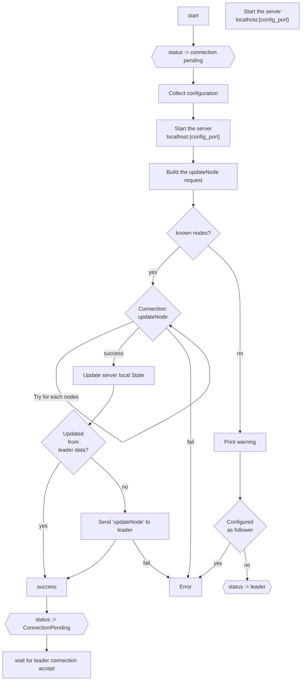
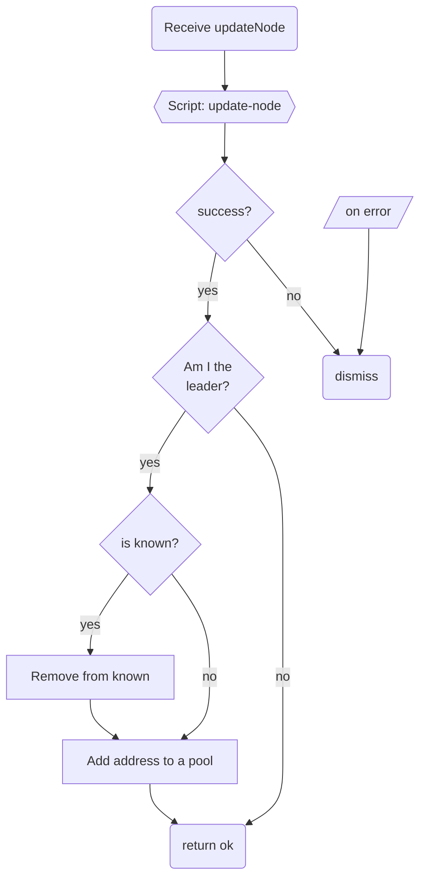
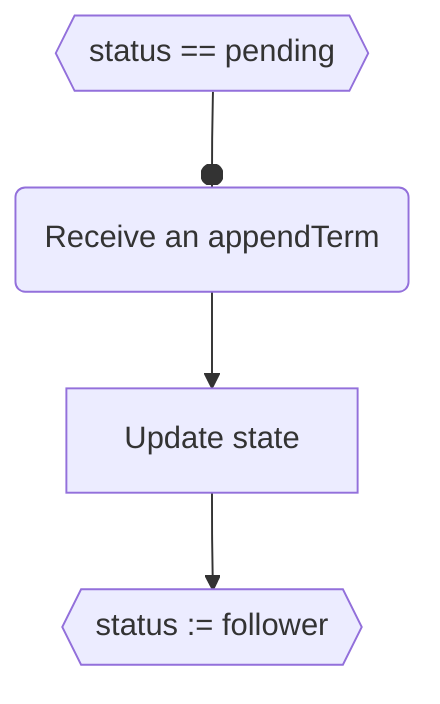

# Connection workflow

## Connection (your side)

> Local server state is updated with the response of the updateNode request.
> - `leaderId` so follower can redirect clients
> - `leaderCommit` leader’s `commitIndex`
  

 

---

## On receive connection request (network side)

> The pool of connection request is managed in the same thread than the send of terms. An appendTerm should be send with a special information for the network. This information permit to the network to add the new address. **The sender of the request receive a special term when the previous is commited**.

 

---

## Receiving connection accepted (your side)

The first term that your node receive means that your node has been accepted and commited in the network.

