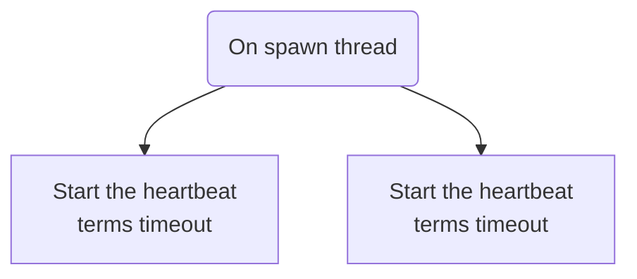
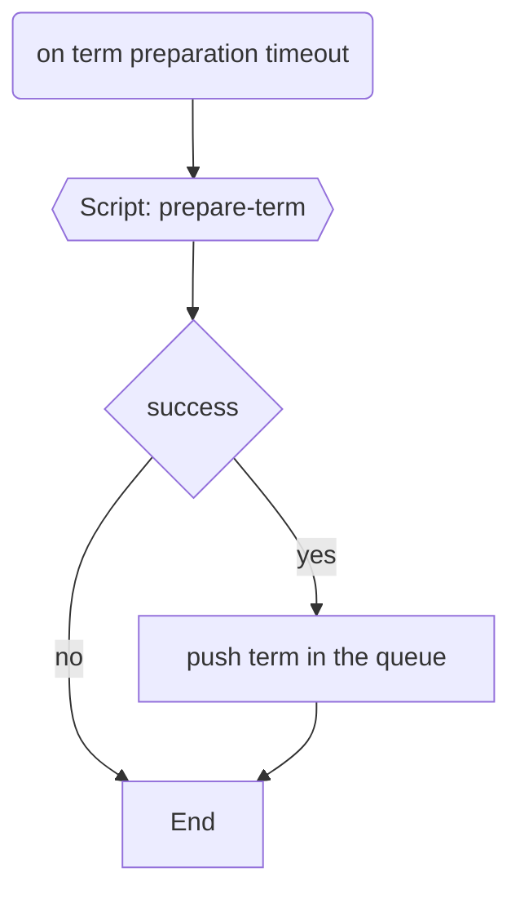
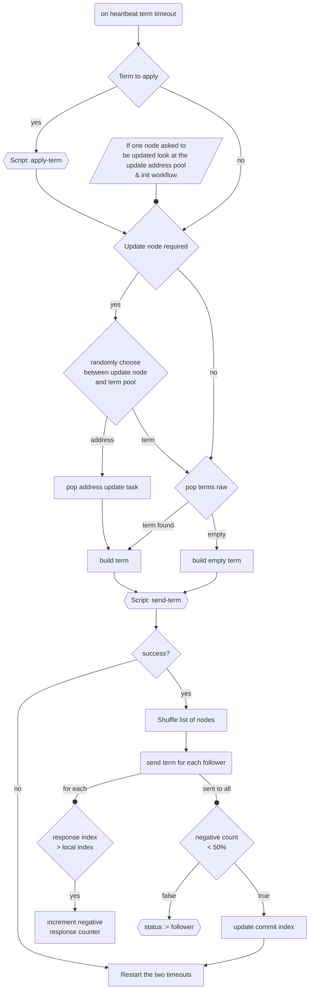

# Leader workflow

The leader workflow is a loop in a dedicated thread. The thread manage with an *address pool*, some *hook scripts* and send terms in the network. It doesn't manage the status changes, the vote requests and the append term request. The worker thread is spawned only when you became a leader.

The workflow use the words queue or pool, it's the same thing and just means that it interact with a global variable accessible between threads. For the *addresses* it's mean a list of `updateNode` requests to handle and manage. By *terms queue*, it means a list of terms raw prepared filled by the leader and sent by the leader.

Scripts are performed asynchronously with concurrency in the thread worker.

  

---
## On start

  

---

## On preparation timeout

  

---

## On heartbeat timeout

