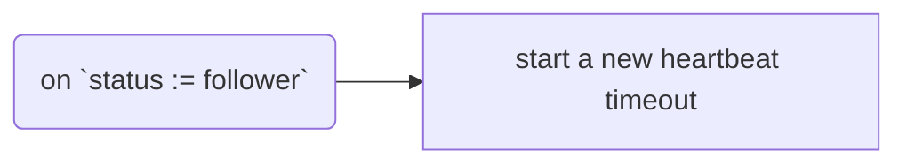
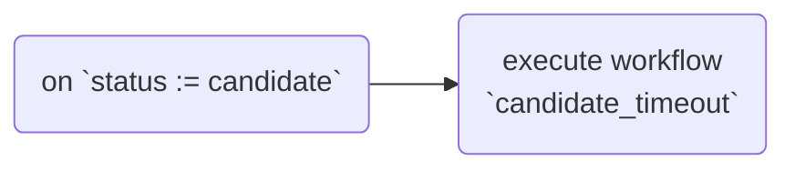
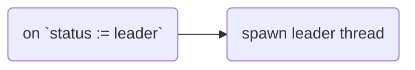
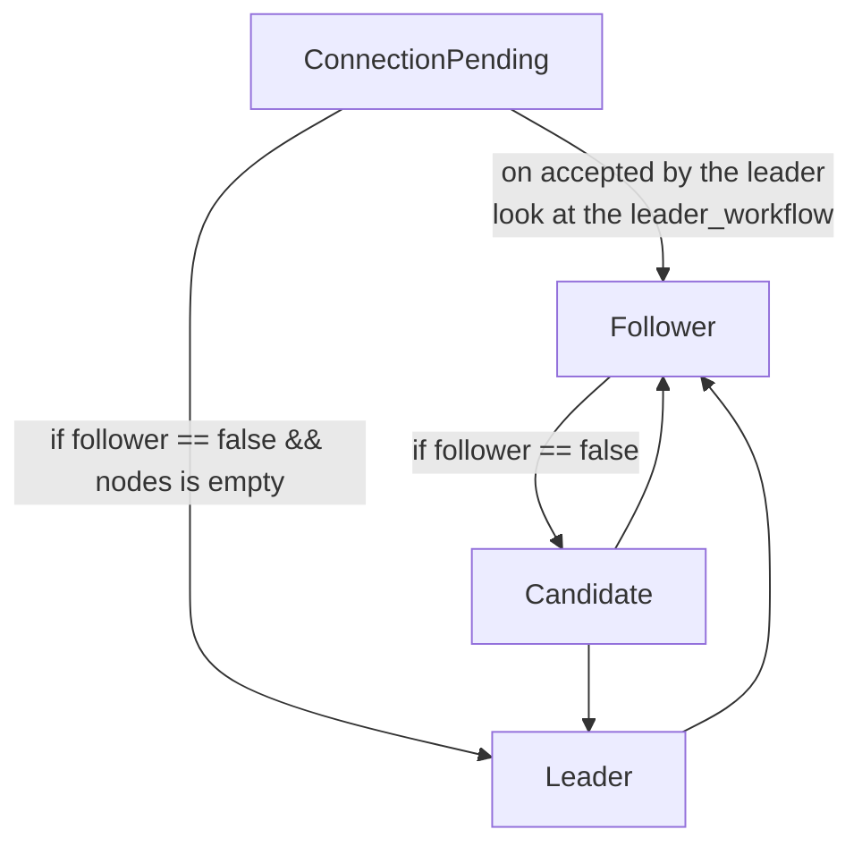

# Listening the status modificatons

The status are those:
- pending (ConnectionPending)
- follower
- candidate
- leader

When the status change the local state also may change.

# Allowed States Flow

The following graph describe the allowed states changes that can happen in the code. (Look a the `mod state`)

The only way to create a status in release is to use a `create` method and return a Status configured as ConnectionPending. If you want to get a follower or something else, you should follow the following graph steps.

