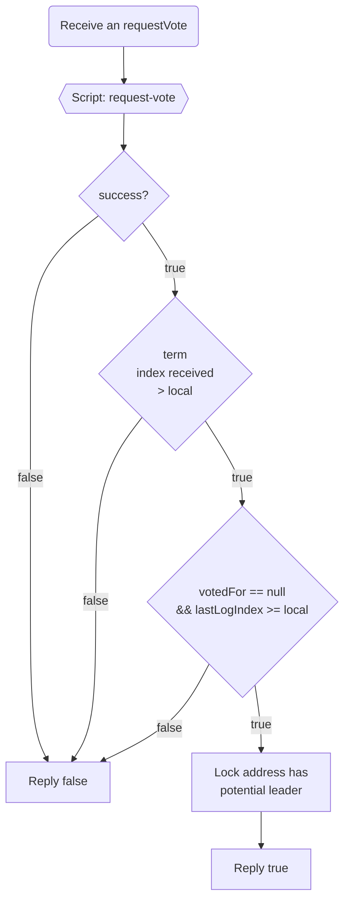

# On request vote receive

  

> In this workflow, we don't check if we are a leader or not, it's free to manage this behavior in another side module using clearly the hooks.
> You can also manage a `loyal` rule to prevent request spamming 
